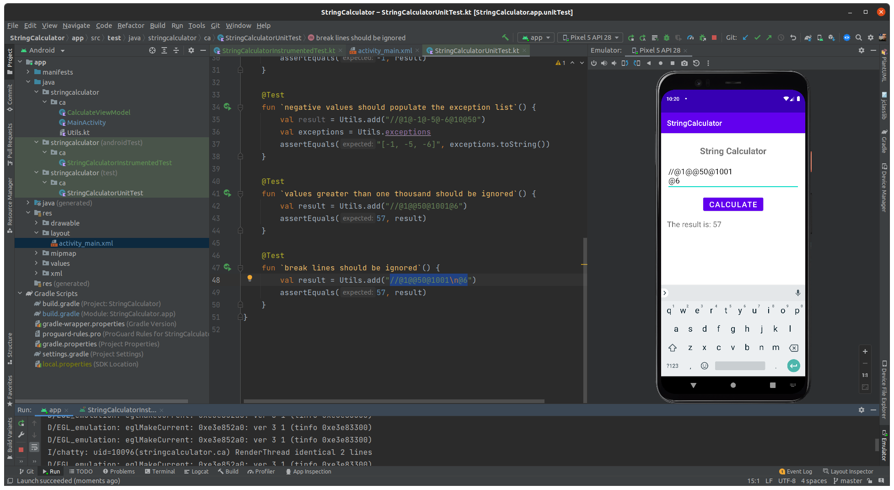
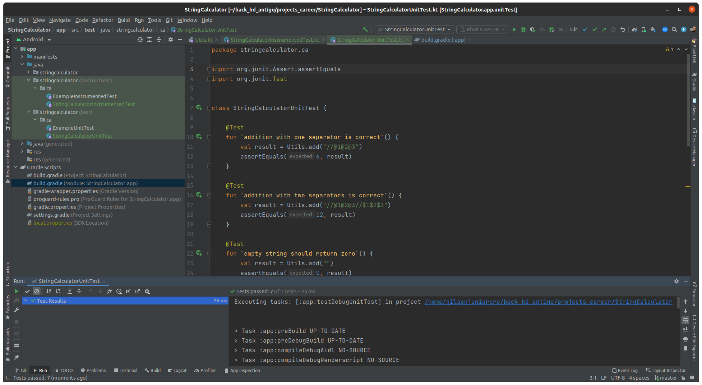

# StringCalculator

### **Overview - About this project**
This is a simple String Calculator with the below features

1. Create a simple String calculator with a method: int Add(string numbers)
a. The numbers in the string are separated by a comma.
b. Empty strings should return 0.
c. The return type should be an integer.
d. Example input: “1,2,5” - expected result: “8”.
e. Write tests to prove your input validates.
2. Change the Add method to handle new lines in the input format
a. Example: “1\n,2,3” - Result: “6”
b. Example 2: “1,\n2,4” - Result: “7”
3. Support a custom delimiter
a. The beginning of your string will now contain a small control code that lets you
set a custom delimiter.
b. Format: “//[delimiter]\n[delimiter separated numbers]”
c. Example: “//;\n1;3;4” - Result: 8
d. In the above you can see that following the double forward slash we set a
semicolon, followed by a new line. We then use that delimiter to split our
numbers.
e. e. Other examples
i. “//$\n1$2$3” - Result: 6
ii. “//@\n2@3@8” - Result: 13

4. Calling add with a negative number should throw an exception: “Negatives not allowed”.
The exception should list the number(s) that caused the exception

Bonus
1. Numbers larger than 1000 should be ignored.
a. Example “2,1001” - Result: 2
2. Delimiters can be arbitrary length
a. “//***\n1***2***3” - Result 6
3. Allow for multiple delimiters
a. “//$,@\n1$2@3” - Result 6
4. Combine 2 and 3 bonus questions. Allow multiple delimiters of arbitrary length

### 📷 How is this App
</img>
</img>
</img>

### 💻Technology
- [Kotlin](https://kotlinlang.org/)
 
### Donation
If this project help you reduce time to develop, you can buy me a cup of coffee :) 

